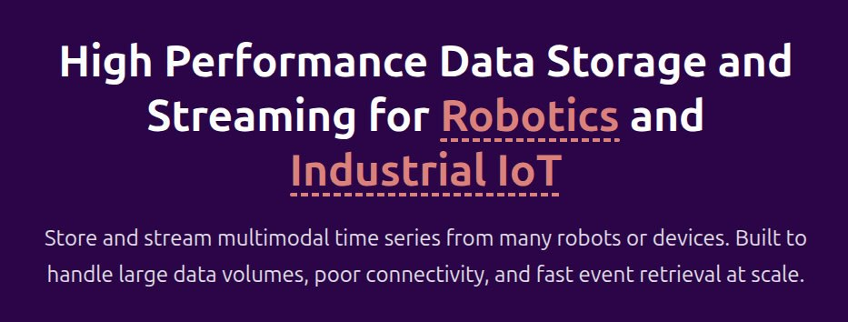

<p align="center">
  <a href="https://www.reduct.store">
    
  </a>
</p>

<p align="center">
  <a href="https://github.com/reductstore/reductstore/releases/latest"></a>
  <a href="https://github.com/reductstore/reductstore/actions"></a>
  <a href="https://hub.docker.com/r/reduct/store"></a>
  <a href="https://github.com/reductstore/reductstore/releases/latest"></a>
  <a href="https://codecov.io/gh/reductstore/reductstore"></a>
  <a href="https://community.reduct.store/signup"></a>
</p>

ReductStore makes robotics and industrial data queryable.

Store terabytes of images, sensor readings, logs, files, and ROS bags with timestamps and labels in one system, then query them by time range and context instead of stitching together a TSDB, object storage, and custom retention jobs.

## Why Teams Pick ReductStore

- Make binary-first robotics and industrial data queryable by time range and labels
- Built for workloads such as camera frames, sensor payloads, logs, files, and ROS bags
- Replicate only selected records to the cloud to reduce bandwidth and storage cost
- Apply quotas and lifecycle policies in the same system that stores the data

## Proof Points

<p align="center">
  <strong>🚀 60k+</strong> downloads
  &nbsp;&nbsp;•&nbsp;&nbsp;
  <strong>🏭 100+</strong> production deployments
  &nbsp;&nbsp;•&nbsp;&nbsp;
  <strong>📦 1 PB+</strong> managed data
</p>

<p align="center">
  <strong>⭐ 350+</strong> GitHub stars
  &nbsp;&nbsp;•&nbsp;&nbsp;
  <strong>👥 13</strong> contributors
</p>

## When You Should Use It

ReductStore is ideal for scenarios where you have a continuous stream of binary data and your application has metadata that can be attached to the data as labels.
If you ingest binary data with labels into a ReductStore instance, you can use it to:

1. Query objects by time range and labels, e.g. "give me all the images from camera-1 over the last hour where the device status is 'error'".
2. Replicate only selected data to another ReductStore instance, e.g. "replicate all the data from camera-1 where the device status is 'error' to the cloud instance for further analysis".
3. Manage the data lifecycle with policies, e.g. "keep all the data from camera-1 for 30 days, then compress it and keep it for another 60 days before deleting it".

In such scenarios, ReductStore can help you manage and transfer your data efficiently based on its metadata, without combining a TSDB and blob storage. This keeps your architecture simple and efficient.

## Who It Is For

- Robotics platforms that need to replay camera frames, telemetry, and logs around incidents or model failures
- Industrial IoT pipelines that collect binary payloads at the edge and forward only filtered data upstream
- Edge AI systems that need retention, labeling, and historical retrieval without building a custom storage stack

## When You Should Not Use It

ReductStore is not the best fit for every data storage problem. You should consider another solution when:

1. You have only numerical data that can be easily ingested into a time-series database.
2. You have only blob data to store and do not need to access it as historical data. In this case, object storage or a file system may be a better fit.
3. You need a message broker. Although ReductStore provides subscription and publishing functionality, it is designed for data storage and streaming, not message queueing.

## Get Started

The quickest way to get up and running is with our Docker image:

```
docker run -p 8383:8383 -v reduct-data:/data reduct/store:latest
```

If you prefer a bind mount instead of a Docker volume:

```bash
mkdir -p ./data
sudo chown -R 10001:10001 ./data
docker run -p 8383:8383 -v ${PWD}/data:/data reduct/store:latest
```

Alternatively, you can opt for Cargo:

```bash
# Install Rust via the official rustup instructions:
# https://www.rust-lang.org/tools/install
apt install protobuf-compiler
cargo install --locked reductstore
RS_DATA_PATH=./data reductstore
```

For a more in-depth guide, visit the **[Getting Started](https://reduct.store/docs/)** and **[Download](https://www.reduct.store/download)** sections.

After initializing the instance, you can start writing and querying data immediately. Here's a Python sample:

```python
from reduct import Client, BucketSettings, QuotaType

async def main():
    # 1. Create a ReductStore client
    async with Client("http://localhost:8383", api_token="my-token") as client:
        # 2. Get or create a bucket with 1Gb quota
        bucket = await client.create_bucket(
            "my-bucket",
            BucketSettings(quota_type=QuotaType.FIFO, quota_size=1_000_000_000),
            exist_ok=True,
        )

        # 3. Write some data with timestamps and labels to the 'entry-1' entry
        await bucket.write("/telemetry/sensor-1", b"<Blob data>", timestamp="2024-01-01T10:00:00Z",
                           labels={"score": 10})
        await bucket.write("/telemetry/sensor-2", b"<Blob data>", timestamp="2024-01-01T10:00:01Z",
                           labels={"score": 20})

        # 4. Query the data by time range and condition
        async for record in bucket.query("/telemetry/*",
                                         start="2024-01-01T10:00:00Z",
                                         stop="2024-01-01T10:00:02Z",
                                         when={"&score": {"$gt": 20}}):
            print(f"Entry name: {record.entry}")
            print(f"Record timestamp: {record.timestamp}")
            print(f"Record size: {record.size}")
            print(await record.read_all())


# 5. Run the main function
if __name__ == "__main__":
    import asyncio
    asyncio.run(main())
```

## Next Steps

Learn more and pick the next piece you need:

- [Rust Client SDK](https://github.com/reductstore/reduct-rs)
- [Python Client SDK](https://github.com/reductstore/reduct-py)
- [JavaScript Client SDK](https://github.com/reductstore/reduct-js)
- [C++ Client SDK](https://github.com/reductstore/reduct-cpp)
- [Go Client SDK](https://github.com/reductstore/reduct-go)
- [CLI Client](https://github.com/reductstore/reduct-cli) - a command-line interface for direct interactions with ReductStore
- [Web Console](https://github.com/reductstore/web-console) - a web interface to administrate a ReductStore instance
- [ReductBridge](https://github.com/reductstore/reduct-bridge) - a data collector to get data from various sources and write it to ReductStore
- [Documentation](https://www.reduct.store/docs/)
- [Download](https://www.reduct.store/download)
- [Community Forum](https://community.reduct.store)
- [Good First Issues](https://github.com/reductstore/reductstore/issues?q=is%3Aissue%20is%3Aopen%20label%3A%22good%20first%20issue%22)

## **Feedback & Contribution**

Your input is invaluable to us! 🌟 If you've found a bug, have suggestions for improvements, or want to contribute directly to the codebase, here's how you can help:

- **Questions and Ideas**: Join our [**Discourse community**](https://community.reduct.store) to ask questions, share ideas, and collaborate with fellow ReductStore users.
- **Bug Reports**: Open an issue on our **[GitHub repository](https://github.com/reductstore/reductstore/issues)**. Please provide as much detail as possible so we can address it effectively.
- **First Contributions**: Pick a task from [**good first issues**](https://github.com/reductstore/reductstore/issues?q=is%3Aissue%20is%3Aopen%20label%3A%22good%20first%20issue%22) or [**help wanted**](https://github.com/reductstore/reductstore/issues?q=is%3Aissue%20is%3Aopen%20label%3A%22help%20wanted%22).

## **Get Involved**

We believe in the power of community and collaboration. If you've built something amazing with ReductStore, we'd love to hear about it. Share your projects, benchmarks, and lessons learned on our [Discourse community](https://community.reduct.store).

If you find ReductStore beneficial, give us a ⭐ on our GitHub repository.

## Contributors

Thanks to everyone who has contributed to ReductStore.

<p align="center">
  <a href="https://github.com/atimin"></a>
  <a href="https://github.com/apps/dependabot"></a>
  <a href="https://github.com/mother-6000"></a>
  <a href="https://github.com/AnthonyCvn"></a>
  <a href="https://github.com/DibbayajyotiRoy"></a>
  <a href="https://github.com/rtadepalli"></a>
  <a href="https://github.com/rohankumardubey"></a>
  <a href="https://github.com/tuanhungngyn"></a>
  <a href="https://github.com/apps/copilot-swe-agent"></a>
  <a href="https://github.com/mambaz"></a>
  <a href="https://github.com/victor1234"></a>
  <a href="https://github.com/aschenbecherwespe"></a>
  <a href="https://github.com/renghen"></a>
</p>

Your support fuels our passion and drives us to keep improving.

Together, let's redefine the future of blob data storage! 🚀
